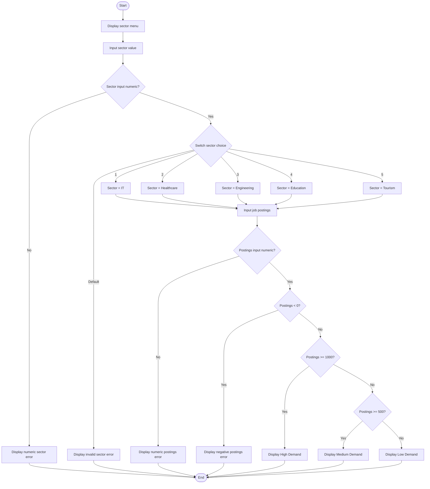

# Flowgraph For Job Demand Classification Algorithm

Student ID: 24s25365  
Student Name: Zaafir Sajid

## Mermaid Flowgraph



## Flowgraph Description

The program starts by displaying the sector menu. It first checks whether the sector input is numeric. If it is not numeric, an error message is shown. If it is numeric, a switch statement is used to identify the sector. If the sector number is not between 1 and 5, the program displays an invalid sector error.

For a valid sector, the program asks for the number of job postings. It checks whether the postings input is numeric. Then it checks for negative postings. Finally, the if-else structure classifies the result as High Demand, Medium Demand, or Low Demand.

## Cyclomatic Complexity

Formula used:

```text
V(G) = Number of decision points + 1
```

Decision points in the actual Java program:

| No. | Decision Point | Reason |
|---|---|---|
| 1 | `!scanner.hasNextInt()` for sector input | Validates numeric sector input |
| 2 | `switch (sectorChoice)` | Selects sector or invalid sector path |
| 3 | `!scanner.hasNextInt()` for job postings input | Validates numeric postings input |
| 4 | `jobPostings < 0` | Checks negative postings |
| 5 | `jobPostings >= HIGH_DEMAND_THRESHOLD` | Checks High Demand |
| 6 | `jobPostings >= MEDIUM_DEMAND_THRESHOLD` | Checks Medium Demand |

```text
V(G) = 6 + 1 = 7
```

The cyclomatic complexity is 7. This means seven independent paths are enough to cover the main logical decisions in this program. The switch statement has different case branches, but for this student-level calculation it is counted as one decision point.

## Independent Paths

| Path No. | Independent Path |
|---|---|
| 1 | Start -> sector input is text -> display numeric sector error -> End |
| 2 | Start -> sector input is numeric -> invalid sector -> display invalid sector error -> End |
| 3 | Start -> valid sector IT -> postings input is text -> display numeric postings error -> End |
| 4 | Start -> valid sector Tourism -> postings = -10 -> display negative postings error -> End |
| 5 | Start -> valid sector IT -> postings = 1200 -> display High Demand -> End |
| 6 | Start -> valid sector Healthcare -> postings = 750 -> display Medium Demand -> End |
| 7 | Start -> valid sector Engineering -> postings = 300 -> display Low Demand -> End |
